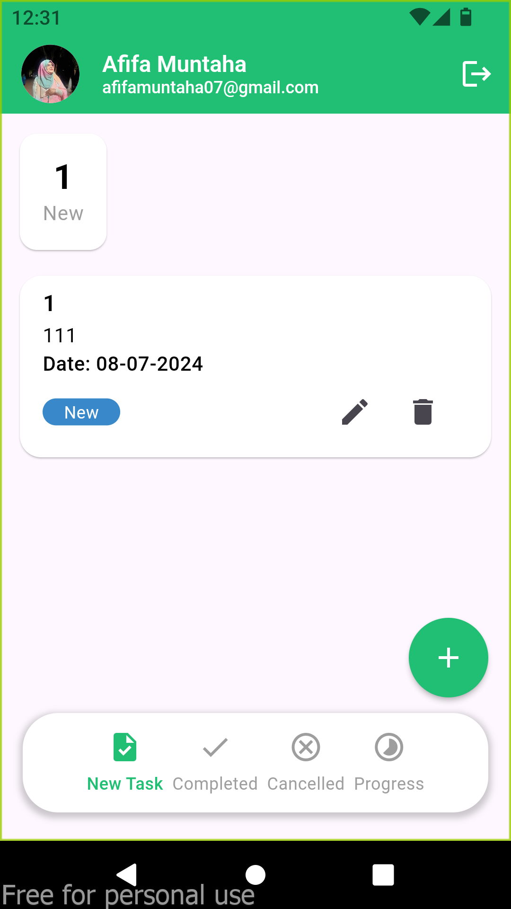
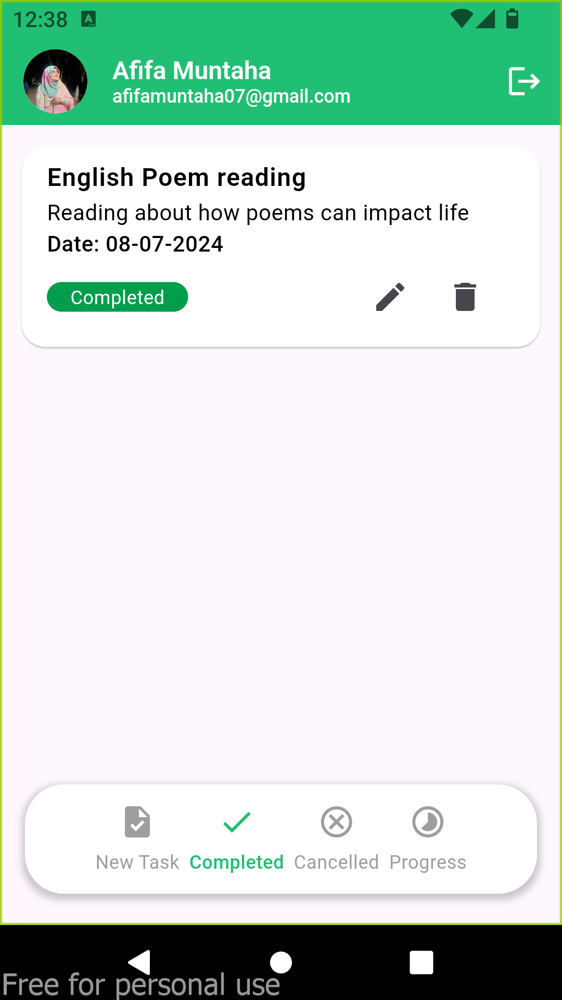
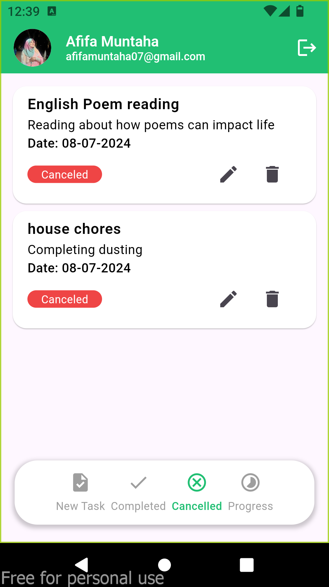
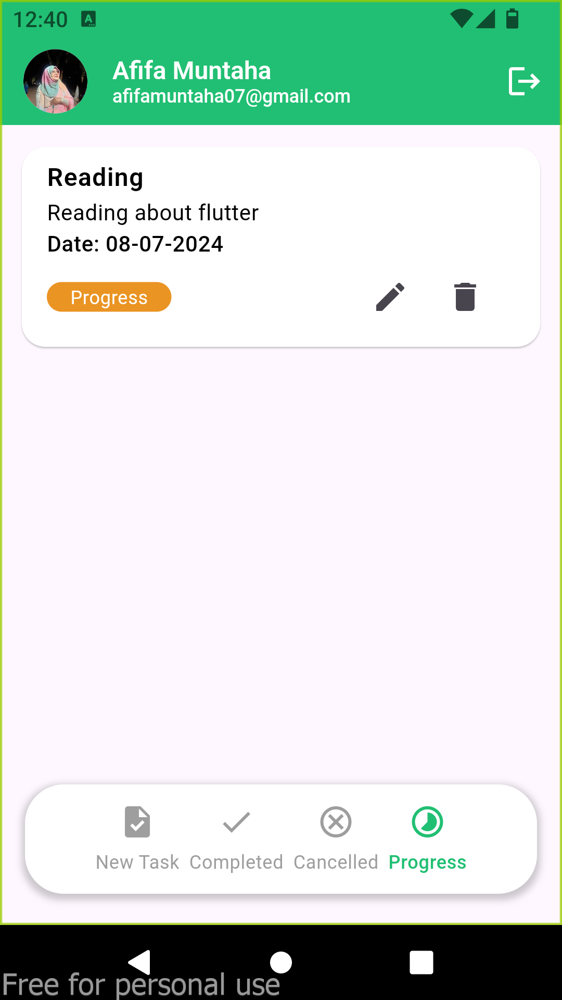
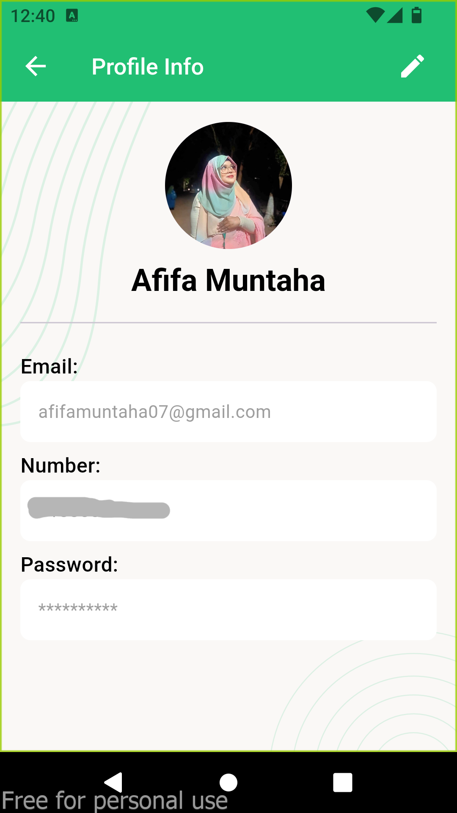
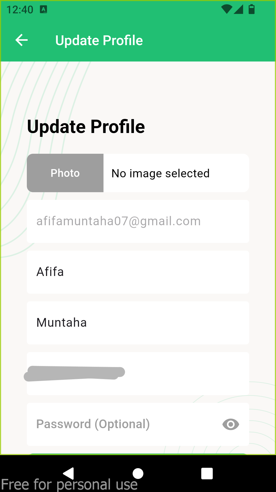

# Task Manager App

This is a Task Manager App that includes the following features:

- **OTP Authentication**: Secure login and registration process using One-Time Passwords (OTP).
- **CRUD Operations**: Create, Read, Update, and Delete tasks with ease.

## Features

- **User Authentication**
  - OTP-based user authentication for secure access.
  
- **Task Management**
  - Create new tasks with detailed descriptions.
  - View a list of all tasks.
  - Update existing tasks.
  - Delete tasks that are no longer needed.

### Task Screens

1. **New Task**
   

2. **Completed Tasks**
   

3. **Cancelled Tasks**
   

4. **In Progress Tasks**
   

### User Screens

5. **User Info**
   

6. **Edit User Info**
   
## Getting Started

### Prerequisites

- Flutter SDK
- Dart
- Any required plugins/packages (listed in `pubspec.yaml`)

### Installation

1. **Clone the Repository**
   ```sh
   git clone https://github.com/Nubla07/Task-Manager-App-with-Flutter.git


